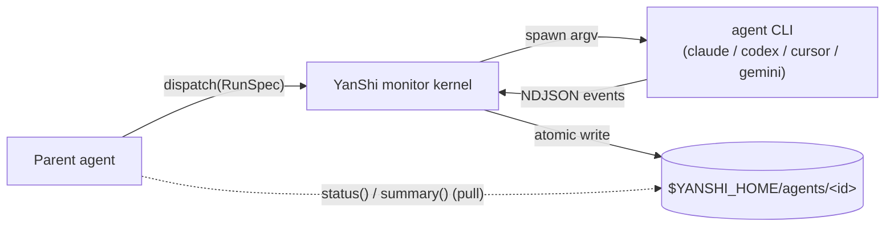

English | [简体中文](README.zh-CN.md)

<div align="center">

# YanShi 燕十三

**A vendor-neutral sub-agent dispatch layer with deterministic, low-context monitoring.**

[](https://www.python.org/downloads/)
[](./LICENSE)
[](https://yorha-agents.github.io/YanShi/)
[](#development)

</div>

> Last-Modified: 2026-06-24

**YanShi** lets a parent agent dispatch work to any headless agent CLI — `claude`, `codex`,
`cursor-agent`, `gemini` — through **one contract**, then monitor it with **deterministic,
low-context** status objects instead of raw log streams. Spawning a sub-agent should not lock you
into a single vendor, and watching it should not flood your context window.

The core value is the split between a **visibility plane** (raw NDJSON streams persisted to disk)
and a **context plane** (a tiny status object pulled on demand). A parent agent orchestrates a
fleet of heterogeneous CLIs while spending only tens of tokens per poll: a fully **deterministic
status object** carries state, counters, usage, cost, and errors, and an **ultralight summarizer**
adds an advisory 1–3 sentence rolling narrative on top.

## Features

- **One contract, many CLIs** — dispatch with a single `RunSpec`; add a CLI by writing one adapter.
- **Low-context monitoring** — pull a compact `AgentStatus` plus a 1–3 sentence rolling summary; raw streams stay on disk and never enter the parent context.
- **Deterministic by design** — ~90% of monitoring (FSM, counters, error class, tokens, cost) needs no LLM; only the rolling summary is advisory and degrades gracefully when no model is available.
- **Safe by default** — `read-only` mode is the default and `yolo` must be explicit; argv-only spawning (no `shell=True`); secret redaction; a cost ceiling guards against runaway loops.
- **Improve loop** — a bounded *dispatch → gate → refine* cycle driven by a deterministic check command.
- **Skill + MCP** — a ready-to-use `skill/SKILL.md` and an optional MCP server shim for agent hosts.

## Architecture



Raw streams land on disk via atomic writes; the parent only ever pulls the small `AgentStatus` and
`summary` back out.

## Install

**Global one-liner** (via the bundled installer, no checkout required):

```bash
curl -fsSL https://raw.githubusercontent.com/YoRHa-Agents/YanShi/main/install.sh | bash -s -- --global
```

**Local / development** (from a clone):

```bash
git clone https://github.com/YoRHa-Agents/YanShi.git
cd YanShi
./install.sh --local --dev
```

The installer is `uv`-first with a `pip` + `venv` fallback. Other flags: `--with-mcp`, `--docs`,
`--dry-run`, `--lang zh|en` (run `./install.sh --help` for the full list).

**`uv` directly:**

```bash
uv tool install .   # install the global `yanshi` CLI from a checkout
uv sync             # create a local editable .venv for development
```

**`pip` directly:**

```bash
pip install .       # standard install into the active environment
```

## Quickstart

```bash
yanshi doctor                                              # 1. verify adapter CLIs + auth
yanshi dispatch --cli claude --effort high --wait \
  "Summarize the architecture of this repo"                # 2. blocking dispatch -> RunResult
yanshi list                                                # 3. known agent ids
yanshi status  <agent_id>                                  # 4. deterministic AgentStatus
yanshi summary <agent_id>                                  # 5. advisory rolling summary
yanshi improve --cli claude "fix the failing unit tests" \
  --check "uv run pytest -q" --max-iterations 3            # 6. bounded improve loop
```

A longer zero-to-first-dispatch walkthrough lives in [QUICKSTART.md](./QUICKSTART.md).

> **Low-context rule:** poll only `status` and `summary`. Raw streams under
> `$YANSHI_HOME/agents/<id>/stream.ndjson` are for audit/debugging and must not be pasted into the
> parent context.

## CLI cheat-sheet

| Command | Description |
| --- | --- |
| `yanshi doctor` | Check registered adapter executables and authentication state. |
| `yanshi dispatch [options] --wait "<prompt>"` | Blocking dispatch through the monitor kernel; prints a `RunResult` (CLI dispatch is always `--wait`). |
| `yanshi improve "<prompt>" --check "<cmd>" [--max-iterations N]` | Bounded dispatch → gate → refine loop; prints an `ImproveResult`. |
| `yanshi list` | List known agent ids. |
| `yanshi status <agent_id>` | Read a deterministic `AgentStatus` snapshot (pure-disk read). |
| `yanshi summary <agent_id>` | Read the advisory 1–3 sentence rolling summary. |
| `yanshi wait <agent_id> [--timeout S]` | Block until the agent reaches a terminal state. |
| `yanshi cancel <agent_id>` | Cancel a run: graceful signal → SIGKILL, then finalize as `cancelled`. |
| `yanshi gc [--older-than S]` | Garbage-collect terminal runs older than a threshold (default `86400`s). |

`dispatch` and `improve` share the policy options `--cli` (`claude`/`codex`/`cursor`/`gemini`),
`--model`, `--effort` (`low`/`medium`/`high`/`xhigh`), `--allow` (`read-only` default / `yolo`),
`--workdir`, and `--timeout`.

## Library

The CLI is one of two entry points onto the same monitor kernel; a long-lived host can dispatch in
the background and poll the same on-disk status:

```python
import asyncio
from yanshi.contracts import RunSpec
from yanshi.dispatch import dispatch_background, status, summary

async def main() -> None:
    handle = dispatch_background(RunSpec(cli="claude", prompt="inspect this repo"))
    result = await handle.task              # or poll status(handle.agent_id) from disk
    print(result.state, result.usage.total)

asyncio.run(main())
```

## Documentation

- **Full documentation** (English + 简体中文): <https://yorha-agents.github.io/YanShi/>
- **Quickstart:** [QUICKSTART.md](./QUICKSTART.md) · [简体中文](./QUICKSTART.zh-CN.md)
- **Skill contract:** [skill/SKILL.md](./skill/SKILL.md)
- **Design spec** (source of truth): [`.local/memory/specs/yanshi/spec.md`](./.local/memory/specs/yanshi/spec.md)

## Development

```bash
uv sync --group dev
uv run pytest -m "not live" --cov=yanshi
uv run ruff check .
uv run mypy --strict src tests
```

Build and preview the docs locally:

```bash
uv sync --group docs
mkdocs serve
```

### Safety invariants

- Subprocesses are spawned with argv lists only; `shell=True` is forbidden, and prompt text is
  passed via stdin or a single argv value — never shell-interpolated.
- `allow=read-only` is the default; dangerous vendor flags require an explicit `allow=yolo`.
- Secrets are redacted before anything is written to disk or fed to the summarizer, and a per-run
  plus global cost ceiling guards against runaway spend.
- Preflight fails fast when a target binary or its authentication is unavailable; all errors surface
  as explicit result/status data (no silent failures).

### Known limitations

- No vendor CLI exposes a context-window flag, so YanShi controls input size and model choice only
  and relies on each CLI's automatic compaction.
- `reasoning_effort` is not portable (e.g. `cursor` encodes it in the model name); unsupported
  controls degrade with a structured warning rather than silently pretending to work.
- When pricing is unknown (`pricing_status=missing`), the USD cost ceiling degrades to a
  token-based guard.
- There is no git-worktree or container isolation — file/workspace isolation is the caller's
  responsibility via `workdir` / `add_dirs`.
- The rolling summary is advisory (LLM-generated); every decision field is deterministic.

## License

[MIT](./LICENSE) © YoRHa-Agents.
