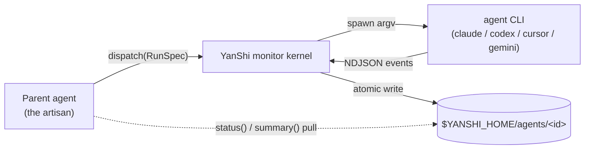

English | [简体中文](README.zh-CN.md)

<div align="center">

# YanShi 偃师

**One contract for sub-agent CLIs. Deterministic control threads for low-context monitoring.**

[](https://www.python.org/downloads/)
[](./LICENSE)
[](https://yorha-agents.github.io/YanShi/)
[](#development)

</div>

> Last-Modified: 2026-06-25

**YanShi (偃师)** is a Python 3.12+ vendor-neutral dispatch layer for sub-agent CLIs. It lets a
parent agent send work to `claude`, `codex`, `cursor-agent`, `gemini`, and future adapters through
one contract, then monitor the run by pulling compact status and summary objects instead of reading
raw log streams.

The name points to the mythic artisan who animated mechanisms. In YanShi, the parent agent is the
artisan, each headless CLI is a mechanism, and `status` / `summary` are the control threads. The
metaphor is only there to make the orchestration model memorable: the technical invariants stay
plain, deterministic, and auditable.

## What YanShi Gives You

- **One contract across agent CLIs** — dispatch with a single `RunSpec`; add a vendor by adding one
  adapter, not by rewriting orchestration code.
- **Low-context monitoring** — raw NDJSON stays on disk; the parent pulls a small `AgentStatus` and
  an advisory 1-3 sentence rolling summary.
- **Deterministic state first** — FSM state, counters, token usage, cost, error category, and
  lifecycle are reducer-driven; the summarizer never owns decision fields.
- **Safe defaults** — `read-only` is the default, `yolo` must be explicit, subprocesses spawn by
  argv only, secrets are redacted, and errors surface in result/status data.
- **Bounded improvement loops** — `yanshi improve` runs dispatch -> check -> refine under explicit
  iteration and timeout controls.
- **Host-friendly delivery** — use the Python library, the `yanshi` CLI, `skill/SKILL.md`, or the
  optional MCP shim from the same monitor kernel.

## Architecture



YanShi separates the **visibility plane** from the **context plane**. The visibility plane is the
raw event stream persisted under `$YANSHI_HOME/agents/<id>/`. The context plane is the tiny pulled
view: state, usage, cost, warnings, errors, and a short rolling summary. A parent agent can monitor
many mechanisms without flooding its own prompt.

## Install

**Global one-liner** (via the bundled installer, no checkout required):

```bash
curl -fsSL https://raw.githubusercontent.com/YoRHa-Agents/YanShi/main/install.sh | bash -s -- --global
```

**Local / development** (from a clone):

```bash
git clone https://github.com/YoRHa-Agents/YanShi.git
cd YanShi
./install.sh --local --dev
```

The installer is `uv`-first with a `pip` + `venv` fallback. Other flags: `--with-mcp`, `--docs`,
`--dry-run`, `--lang zh|en` (run `./install.sh --help` for the full list).

**`uv` directly:**

```bash
uv tool install .   # install the global `yanshi` CLI from a checkout
uv sync             # create a local editable .venv for development
```

**`pip` directly:**

```bash
pip install .       # standard install into the active environment
```

## Quickstart

Start by checking which mechanisms are available, then make one blocking dispatch and inspect the
control threads it leaves behind:

```bash
yanshi doctor                                              # 1. verify adapter CLIs + auth
yanshi dispatch --cli claude --effort high --wait \
  "Summarize the architecture of this repo"                # 2. blocking dispatch -> RunResult
yanshi list                                                # 3. known agent ids
yanshi status  <agent_id>                                  # 4. deterministic AgentStatus
yanshi summary <agent_id>                                  # 5. advisory rolling summary
yanshi improve --cli claude "fix the failing unit tests" \
  --check "uv run pytest -q" --max-iterations 3            # 6. bounded improve loop
```

A longer zero-to-first-dispatch walkthrough lives in [QUICKSTART.md](./QUICKSTART.md).

> **Low-context rule:** poll only `status` and `summary`. Raw streams under
> `$YANSHI_HOME/agents/<id>/stream.ndjson` are for audit and debugging; they should not be pasted
> into the parent agent context.

## Configuration

YanShi reads an optional repo-level `.yanshi.toml` discovered by walking up from the current
directory, layered above global `$YANSHI_HOME/config.toml`, and overridden per call. Use `yanshi
init` to scaffold a commented starter file; it refuses to overwrite an existing target unless
`--force` is explicit:

```bash
yanshi init                  # scaffold ./.yanshi.toml
yanshi config                # print the resolved config + provenance as JSON
```

Configuration controls enabled **adapters**, dispatch **defaults**, named **profiles** selected with
`--profile`, hard **limits** clamped with warnings, and the optional **summarizer**. Different repos
can expose different mechanisms on the same machine, while `yanshi config` shows exactly which layer
provided each value.

## CLI Cheat-Sheet

| Command | Description |
| --- | --- |
| `yanshi doctor` | Check registered adapter executables and authentication state. |
| `yanshi dispatch [options] --wait "<prompt>"` | Blocking dispatch through the monitor kernel; prints a `RunResult` (CLI dispatch is always `--wait`). |
| `yanshi improve "<prompt>" --check "<cmd>" [--max-iterations N]` | Bounded dispatch -> gate -> refine loop; prints an `ImproveResult`. |
| `yanshi list` | List known agent ids. |
| `yanshi status <agent_id>` | Read a deterministic `AgentStatus` snapshot (pure disk read). |
| `yanshi summary <agent_id>` | Read the advisory 1-3 sentence rolling summary. |
| `yanshi wait <agent_id> [--timeout S]` | Block until the agent reaches a terminal state. |
| `yanshi cancel <agent_id>` | Cancel a run: graceful signal -> SIGKILL, then finalize as `cancelled`. |
| `yanshi gc [--older-than S]` | Garbage-collect terminal runs older than a threshold (default `86400`s). |

`dispatch` and `improve` share the policy options `--cli` (`claude`/`codex`/`cursor`/`gemini`),
`--model`, `--effort` (`low`/`medium`/`high`/`xhigh`), `--allow` (`read-only` default / `yolo`),
`--workdir`, and `--timeout`.

## Library

The CLI is one entrance to the same monitor kernel. A long-lived host can dispatch in the background
and poll the same on-disk state:

```python
import asyncio

from yanshi.contracts import RunSpec
from yanshi.dispatch import dispatch_background, status, summary


async def main() -> None:
    handle = dispatch_background(RunSpec(cli="claude", prompt="inspect this repo"))
    result = await handle.task              # or poll status(handle.agent_id) from disk
    print(result.state, result.usage.total)


asyncio.run(main())
```

## Documentation

- **Full documentation** (English + 简体中文): <https://yorha-agents.github.io/YanShi/>
- **Quickstart:** [QUICKSTART.md](./QUICKSTART.md) · [简体中文](./QUICKSTART.zh-CN.md)
- **Skill contract:** [skill/SKILL.md](./skill/SKILL.md)
- **Product and design context:** [PRODUCT.md](./PRODUCT.md) · [DESIGN.md](./DESIGN.md)
- **Source-of-truth spec:** [`.local/memory/specs/yanshi/spec.md`](./.local/memory/specs/yanshi/spec.md)

## Development

```bash
uv sync --group dev
uv run pytest -m "not live" --cov=yanshi
uv run ruff check .
uv run mypy --strict src tests
```

Build and preview the docs locally:

```bash
uv sync --group docs
mkdocs serve
```

### Safety Invariants

- Subprocesses are spawned with argv lists only; `shell=True` is forbidden, and prompt text is
  passed via stdin or a single argv value, never shell-interpolated.
- `allow=read-only` is the default; dangerous vendor flags require explicit `allow=yolo`.
- Raw NDJSON and transcripts stay on disk; parent agents pull status and summary instead of reading
  raw streams into context.
- Secrets are redacted before anything is written to disk or fed to the summarizer.
- Preflight fails fast when a target binary or authentication is unavailable; all errors surface as
  explicit result/status data.
- Cost ceilings are enforced where pricing is known and degrade to token-based guards when pricing
  is missing.

### Known Limitations

- No vendor CLI exposes a context-window flag, so YanShi controls input size and model choice only
  and relies on each CLI's automatic compaction.
- `reasoning_effort` is not portable; unsupported controls degrade with a structured warning rather
  than silently pretending to work.
- When pricing is unknown (`pricing_status=missing`), USD ceilings cannot be exact and fall back to
  token-based protection.
- There is no git-worktree or container isolation; file/workspace isolation is the caller's
  responsibility via `workdir` and `add_dirs`.
- The rolling summary is advisory and may be LLM-generated; every decision field is deterministic.

## License

[MIT](./LICENSE) © YoRHa-Agents.
