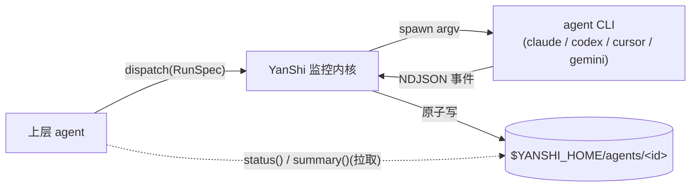

[English](README.md) | 简体中文

<div align="center">

# YanShi 燕十三

**厂商中立的 sub-agent 调度层,提供确定性、低上下文的监控。**

[](https://www.python.org/downloads/)
[](./LICENSE)
[](https://yorha-agents.github.io/YanShi/)
[](#开发)

</div>

> Last-Modified: 2026-06-24

**YanShi(燕十三)** 让上层 agent 通过**统一契约**把任务派发给任意 headless agent CLI——`claude`、
`codex`、`cursor-agent`、`gemini`——并用**确定性、低上下文**的状态对象进行监控,而不是把原始日志流读进
上下文。派生子智能体不应被锁死在单一厂商,监控它也不应撑爆你的上下文窗口。

其核心价值在于把**可见性平面**(原始 NDJSON 流落盘)与**上下文平面**(按需拉取的小状态对象)分离。上层
agent 可以编排一支异构 CLI 舰队,而每次轮询只花费几十个 token:一个完全**确定性的状态对象**承载状态、
计数、用量、花费与错误,再由一个**超轻量摘要器**在其上补充一段建议性的 1~3 句滚动叙述。

## 特性

- **一套契约,多种 CLI** —— 用单个 `RunSpec` 派发;新增 CLI 只需写一个适配器。
- **低上下文监控** —— 拉取紧凑的 `AgentStatus` 加上 1~3 句滚动摘要;原始流留在磁盘,绝不进入上层上下文。
- **确定性优先** —— 约 90% 的监控(状态机、计数、错误分类、token、cost)无需 LLM;只有滚动摘要是建议性的,且在无模型可用时优雅降级。
- **默认安全** —— 默认 `read-only`,`yolo` 必须显式;仅以 argv 方式 spawn(禁止 `shell=True`);密钥脱敏;花费上限防止失控循环。
- **改进循环** —— 由确定性检查命令驱动的有界 *派发 → 闸门 → 精修* 循环。
- **Skill + MCP** —— 开箱即用的 `skill/SKILL.md` 与可选的 MCP server shim,供 agent 宿主接入。

## 架构



原始流通过原子写落盘;上层只取回小小的 `AgentStatus` 与 `summary`。

## 安装

**一行命令全局安装**(通过自带安装器,无需克隆代码库):

```bash
curl -fsSL https://raw.githubusercontent.com/YoRHa-Agents/YanShi/main/install.sh | bash -s -- --global
```

**本地 / 开发安装**(从克隆的代码库):

```bash
git clone https://github.com/YoRHa-Agents/YanShi.git
cd YanShi
./install.sh --local --dev
```

安装器优先使用 `uv`,并以 `pip` + `venv` 兜底。其他参数:`--with-mcp`、`--docs`、`--dry-run`、
`--lang zh|en`(完整列表见 `./install.sh --help`)。

**直接用 `uv`:**

```bash
uv tool install .   # 从代码库安装全局 `yanshi` CLI
uv sync             # 创建本地可编辑的 .venv 供开发
```

**直接用 `pip`:**

```bash
pip install .       # 标准安装到当前激活的环境
```

## 快速开始

```bash
yanshi doctor                                              # 1. 校验适配器 CLI + 鉴权
yanshi dispatch --cli claude --effort high --wait \
  "总结这个仓库的架构"                                       # 2. 阻塞式派发 -> RunResult
yanshi list                                                # 3. 已知 agent id
yanshi status  <agent_id>                                  # 4. 确定性 AgentStatus
yanshi summary <agent_id>                                  # 5. 建议性滚动摘要
yanshi improve --cli claude "修复失败的单元测试" \
  --check "uv run pytest -q" --max-iterations 3            # 6. 有界改进循环
```

更完整的「从零到首次派发」走查见 [QUICKSTART.zh-CN.md](./QUICKSTART.zh-CN.md)。

> **低上下文规则:** 只轮询 `status` 与 `summary`。`$YANSHI_HOME/agents/<id>/stream.ndjson` 下的
> 原始流仅供审计/调试,绝不应粘贴进上层上下文。

## CLI 速查

| 命令 | 说明 |
| --- | --- |
| `yanshi doctor` | 检查已注册适配器的可执行文件与鉴权状态。 |
| `yanshi dispatch [options] --wait "<prompt>"` | 经监控内核做阻塞式派发,打印 `RunResult`(CLI 派发始终为 `--wait`)。 |
| `yanshi improve "<prompt>" --check "<cmd>" [--max-iterations N]` | 有界的 派发 → 闸门 → 精修 循环,打印 `ImproveResult`。 |
| `yanshi list` | 列出已知 agent id。 |
| `yanshi status <agent_id>` | 读取确定性 `AgentStatus` 快照(纯磁盘读)。 |
| `yanshi summary <agent_id>` | 读取建议性的 1~3 句滚动摘要。 |
| `yanshi wait <agent_id> [--timeout S]` | 阻塞直到 agent 进入终态。 |
| `yanshi cancel <agent_id>` | 取消运行:优雅信号 → SIGKILL,随后 finalize 为 `cancelled`。 |
| `yanshi gc [--older-than S]` | GC 超过阈值的终态运行(默认 `86400` 秒)。 |

`dispatch` 与 `improve` 共享策略选项:`--cli`(`claude`/`codex`/`cursor`/`gemini`)、`--model`、
`--effort`(`low`/`medium`/`high`/`xhigh`)、`--allow`(默认 `read-only` / `yolo`)、`--workdir`、
`--timeout`。

## 库用法

CLI 只是同一监控内核的两个入口之一;长驻宿主可以在后台派发,并轮询同一份磁盘状态:

```python
import asyncio
from yanshi.contracts import RunSpec
from yanshi.dispatch import dispatch_background, status, summary

async def main() -> None:
    handle = dispatch_background(RunSpec(cli="claude", prompt="检查这个仓库"))
    result = await handle.task              # 或在磁盘上轮询 status(handle.agent_id)
    print(result.state, result.usage.total)

asyncio.run(main())
```

## 文档

- **完整文档**(English + 简体中文):<https://yorha-agents.github.io/YanShi/>
- **快速开始:** [QUICKSTART.zh-CN.md](./QUICKSTART.zh-CN.md) · [English](./QUICKSTART.md)
- **Skill 契约:** [skill/SKILL.md](./skill/SKILL.md)
- **设计规范**(源头真相): [`.local/memory/specs/yanshi/spec.md`](./.local/memory/specs/yanshi/spec.md)

## 开发

```bash
uv sync --group dev
uv run pytest -m "not live" --cov=yanshi
uv run ruff check .
uv run mypy --strict src tests
```

在本地构建并预览文档:

```bash
uv sync --group docs
mkdocs serve
```

### 安全不变量

- 子进程仅以 argv 列表 spawn;禁止 `shell=True`,prompt 文本经 stdin 或单个 argv 值传入——绝不做
  shell 插值。
- 默认 `allow=read-only`;危险的厂商 flag 需显式 `allow=yolo`。
- 在写入磁盘或喂给摘要器之前先对密钥脱敏,并以 per-run 加全局花费上限防止失控开销。
- 当目标二进制或其鉴权不可用时,preflight 快速失败;所有错误以显式的 result/status 数据暴露(无静默失败)。

### 已知限制

- 没有任何厂商 CLI 暴露 context-window flag,因此 YanShi 只控制输入体量与模型选择,并依赖各 CLI 的自动
  compaction。
- `reasoning_effort` 不可移植(例如 `cursor` 把它编进 model 名);不支持的控制项以结构化 warning 降级,
  而非静默假装生效。
- 当定价未知(`pricing_status=missing`)时,USD 花费上限降级为基于 token 的兜底护栏。
- 没有 git-worktree 或容器隔离——文件/工作区隔离由调用方通过 `workdir` / `add_dirs` 自行负责。
- 滚动摘要是建议性的(LLM 生成);每个可决策字段都是确定性的。

## 许可证

[MIT](./LICENSE) © YoRHa-Agents。
