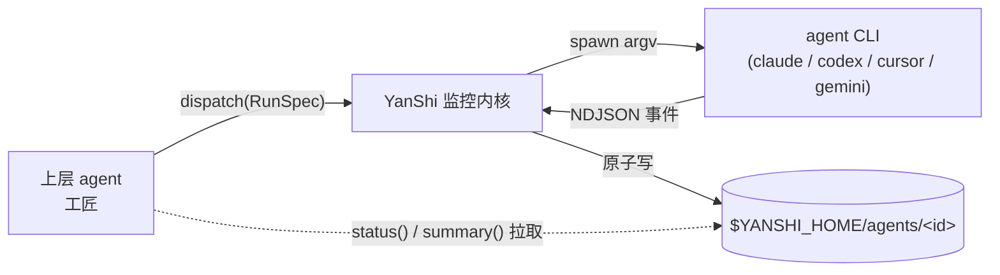

[English](README.md) | 简体中文

<div align="center">

# YanShi 偃师

**一套 sub-agent CLI 契约，以确定性的控制线进行低上下文监控。**

[](https://www.python.org/downloads/)
[](./LICENSE)
[](https://yorha-agents.github.io/YanShi/)
[](#开发)

</div>

> Last-Modified: 2026-06-25

**YanShi（偃师）** 是一个 Python 3.12+ 的厂商中立 sub-agent 调度层。它让上层 agent 通过一套契约把
任务派发给 `claude`、`codex`、`cursor-agent`、`gemini` 以及未来适配器，并通过紧凑的状态与摘要对象
监控运行，而不是把原始日志流读进上下文。

“偃师”来自能驱动机关的神话工匠。在 YanShi 中，上层 agent 是工匠，headless CLI 是机关，`status` 与
`summary` 是控制线。这个隐喻只用于帮助记忆编排模型；真正的技术承诺仍然是明确、确定、可审计。

## YanShi 提供什么

- **一套契约，多种 CLI**：用单个 `RunSpec` 派发；新增厂商只需新增一个适配器，而不是重写编排层。
- **低上下文监控**：原始 NDJSON 留在磁盘；上层只拉取小型 `AgentStatus` 与建议性的 1-3 句滚动摘要。
- **确定性优先**：FSM 状态、计数器、token、cost、错误分类与生命周期都来自 reducer；摘要器不拥有可决策字段。
- **默认安全**：默认 `read-only`，`yolo` 必须显式；子进程只以 argv spawn；密钥脱敏；错误进入 result/status。
- **有界改进循环**：`yanshi improve` 在明确的迭代与超时控制下执行 dispatch -> check -> refine。
- **便于宿主接入**：Python 库、`yanshi` CLI、`skill/SKILL.md` 与可选 MCP shim 共用同一套监控内核。

## 架构



YanShi 将**可见性平面**与**上下文平面**分离。可见性平面是落在
`$YANSHI_HOME/agents/<id>/` 下的原始事件流；上下文平面是按需拉取的小视图：状态、用量、花费、
warning、error 与短摘要。上层 agent 可以同时监控多个机关，而不会被日志洪流淹没。

## 安装

**一行命令全局安装**（通过自带安装器，无需克隆代码库）：

```bash
curl -fsSL https://raw.githubusercontent.com/YoRHa-Agents/YanShi/main/install.sh | bash -s -- --global
```

**本地 / 开发安装**（从克隆的代码库）：

```bash
git clone https://github.com/YoRHa-Agents/YanShi.git
cd YanShi
./install.sh --local --dev
```

安装器优先使用 `uv`，并以 `pip` + `venv` 兜底。它还会**注册 skill**，以便上层 agent 能发现 YanShi
（用 `--no-skill` 跳过，或用 `--skill-dir DIR` 指定目录）。其他参数：`--with-mcp`、`--docs`、
`--dry-run`、`--lang zh|en`（完整列表见 `./install.sh --help`）。

**直接用 `uv`：**

```bash
uv tool install .   # 从代码库安装全局 `yanshi` CLI
uv sync             # 创建本地可编辑的 .venv 供开发
```

**直接用 `pip`：**

```bash
pip install .       # 标准安装到当前激活的环境
```

## 快速开始

先检查哪些机关可用，再做一次阻塞式派发，并查看它留下的控制线：

```bash
yanshi doctor                                              # 1. 校验适配器 CLI + 鉴权
yanshi dispatch --cli claude --effort high --wait \
  "总结这个仓库的架构"                                       # 2. 阻塞式派发 -> RunResult
yanshi list                                                # 3. 已知 agent id
yanshi status  <agent_id>                                  # 4. 确定性 AgentStatus
yanshi summary <agent_id>                                  # 5. 建议性滚动摘要
yanshi improve --cli claude "修复失败的单元测试" \
  --check "uv run pytest -q" --max-iterations 3            # 6. 有界改进循环
```

更完整的「从零到首次派发」走查见 [QUICKSTART.zh-CN.md](./QUICKSTART.zh-CN.md)。

> **低上下文规则：** 只轮询 `status` 与 `summary`。`$YANSHI_HOME/agents/<id>/stream.ndjson` 下的
> 原始流仅供审计和调试，不应粘贴进上层 agent 上下文。

## 初始化与配置

YanShi 会读取可选的仓库级 `.yanshi.toml`，从当前目录沿父目录向上发现，并叠加在全局
`$YANSHI_HOME/config.toml` 之上，再被每次调用参数覆盖。运行 `yanshi init` 可生成带注释的起始文件；
目标已存在且未显式传入 `--force` 时会拒绝覆盖：

```bash
yanshi init                  # scaffold ./.yanshi.toml
yanshi config                # 以 JSON 打印解析后的配置 + provenance
```

配置统一控制启用哪些**适配器**、派发**默认值**、可用 `--profile` 选择的命名 **profiles**、会产生 warning
的硬 **limits**，以及可选的**摘要器**。因此同一台机器上的不同仓库可以暴露不同能力；`yanshi config`
会展示每个解析值来自哪一层。

## CLI 速查

| 命令 | 说明 |
| --- | --- |
| `yanshi doctor` | 检查已注册适配器的可执行文件与鉴权状态。 |
| `yanshi skill register [--skills-dir DIR] [--dry-run]` | 把 `SKILL.md` 注册到 agent skills 目录，便于上层 agent 发现 YanShi。 |
| `yanshi dispatch [options] --wait "<prompt>"` | 经监控内核做阻塞式派发，打印 `RunResult`（CLI 派发始终为 `--wait`）。 |
| `yanshi improve "<prompt>" --check "<cmd>" [--max-iterations N]` | 有界的 dispatch -> check -> refine 循环，打印 `ImproveResult`。 |
| `yanshi list` | 列出已知 agent id。 |
| `yanshi status <agent_id>` | 读取确定性 `AgentStatus` 快照（纯磁盘读）。 |
| `yanshi summary <agent_id>` | 读取建议性的 1-3 句滚动摘要。 |
| `yanshi wait <agent_id> [--timeout S]` | 阻塞直到 agent 进入终态。 |
| `yanshi cancel <agent_id>` | 取消运行：优雅信号 -> SIGKILL，随后 finalize 为 `cancelled`。 |
| `yanshi gc [--older-than S]` | GC 超过阈值的终态运行（默认 `86400` 秒）。 |

`dispatch` 与 `improve` 共享策略选项：`--cli`（`claude`/`codex`/`cursor`/`gemini`）、`--model`、
`--effort`（`low`/`medium`/`high`/`xhigh`）、`--allow`（默认 `read-only` / `yolo`）、`--workdir`、
`--timeout`。

## 库用法

CLI 只是同一监控内核的入口之一；长驻宿主可以在后台派发，并轮询同一份磁盘状态：

```python
import asyncio

from yanshi.contracts import RunSpec
from yanshi.dispatch import dispatch_background, status, summary


async def main() -> None:
    handle = dispatch_background(RunSpec(cli="claude", prompt="检查这个仓库"))
    result = await handle.task              # 或在磁盘上轮询 status(handle.agent_id)
    print(result.state, result.usage.total)


asyncio.run(main())
```

## 文档

- **完整文档**（English + 简体中文）：<https://yorha-agents.github.io/YanShi/>
- **快速开始：** [QUICKSTART.zh-CN.md](./QUICKSTART.zh-CN.md) · [English](./QUICKSTART.md)
- **Skill 契约：** [skill/SKILL.md](./skill/SKILL.md)
- **产品与视觉上下文：** [PRODUCT.md](./PRODUCT.md) · [DESIGN.md](./DESIGN.md)
- **源头规范：** [`.local/memory/specs/yanshi/spec.md`](./.local/memory/specs/yanshi/spec.md)

## 开发

```bash
uv sync --group dev
uv run pytest -m "not live" --cov=yanshi
uv run ruff check .
uv run mypy --strict src tests
```

在本地构建并预览文档：

```bash
uv sync --group docs
mkdocs serve
```

### 安全不变量

- 子进程仅以 argv 列表 spawn；禁止 `shell=True`，prompt 文本经 stdin 或单个 argv 值传入，绝不做 shell 插值。
- 默认 `allow=read-only`；危险的厂商 flag 需显式 `allow=yolo`。
- 原始 NDJSON 与 transcript 留在磁盘；上层 agent 只拉取 status 与 summary，不把原始流读进上下文。
- 在写入磁盘或喂给摘要器之前先对密钥脱敏。
- 当目标二进制或鉴权不可用时，preflight 快速失败；所有错误以显式的 result/status 数据暴露。
- 当定价可用时执行 cost ceiling；定价缺失时降级为基于 token 的护栏。

### 已知限制

- 没有任何厂商 CLI 暴露 context-window flag，因此 YanShi 只控制输入体量与模型选择，并依赖各 CLI 的自动
  compaction。
- `reasoning_effort` 不可移植；不支持的控制项以结构化 warning 降级，而非静默假装生效。
- 当定价未知（`pricing_status=missing`）时，USD 花费上限无法精确执行，会退回 token 级保护。
- 没有 git-worktree 或容器隔离；文件/工作区隔离由调用方通过 `workdir` 与 `add_dirs` 自行负责。
- 滚动摘要是建议性的，可能由 LLM 生成；每个可决策字段都是确定性的。

## 许可证

[MIT](./LICENSE) © YoRHa-Agents。
