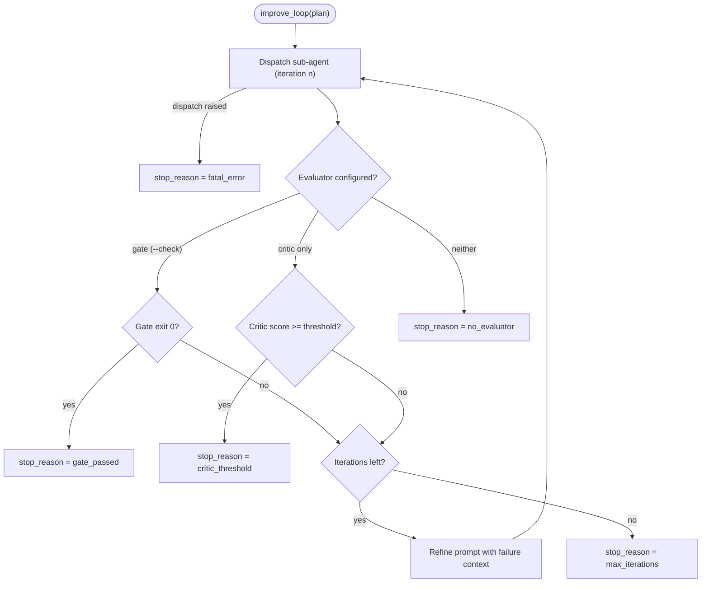

# Improve Loop

`yanshi improve` turns a single-shot dispatch into a **bounded `dispatch → evaluate → refine`
loop**. It dispatches a sub-agent, runs a deterministic gate, and — if the gate fails — re-dispatches
with the failure fed back into the prompt, until the gate passes or the iteration budget is reached.
It is the same deterministic-first, low-context philosophy as the monitor: the gate is authoritative,
and any LLM critic is advisory only.

## The loop



## The gate is authoritative

The gate is the `--check "<command>"` you pass. It is parsed into argv with `shlex` and spawned
**argv-only** (never through a shell). **Exit code `0` means pass**; anything else is a failure.

When the gate fails, only a truncated tail of its combined stdout/stderr (bounded by
`gate_output_limit`, default 4000 characters) is appended to the next prompt — the raw child stream
never re-enters context. A gate that fails to *run at all* (for example a missing binary or a
timeout) is reported in `GateOutcome.error`, distinct from a test that ran and failed.

```bash
yanshi improve --cli claude "fix the failing unit tests" \
  --check "uv run pytest -q" --max-iterations 3
```

## The critic is advisory only

The optional `--critic` enables an LLM critic that mirrors the rolling summarizer: advisory, never
authoritative. It is consulted for the **success decision only when no gate is configured**. When a
gate *is* configured, the gate decides; critic feedback, if enabled, is only used as extra context
for the next refine prompt.

## Bounds and options

The loop is always bounded. Key options (see the [CLI Reference](reference.md#improve) for the full
list):

| Option | Default | Role |
|---|---|---|
| `--check` | — | Deterministic gate command; exit `0` = pass. |
| `--max-iterations` | `3` | Hard cap on dispatch → gate → refine cycles (must be ≥ 1). |
| `--gate-timeout` | `300` | Per-gate timeout in seconds; a timeout fails the gate and is recorded. |
| `--critic` / `--no-critic` | `--no-critic` | Enable the advisory critic. |

## Stop reasons

`ImproveResult.stop_reason` is exactly one of:

| `stop_reason` | Meaning | `succeeded` |
|---|---|---|
| `gate_passed` | The deterministic gate exited `0`. | `true` |
| `critic_threshold` | No gate configured; the critic's score met `critic_threshold`. | `true` |
| `max_iterations` | The iteration budget was exhausted without passing. | `false` |
| `fatal_error` | A dispatch raised; surfaced as a terminal result with a warning. | `false` |
| `no_evaluator` | Neither a gate nor a critic was configured; a single pass ran. | `not is_error` |

Gate, critic, and dispatch problems are never swallowed: they surface in `GateOutcome.error`,
`ImproveResult.warnings`, or a terminal `fatal_error`.

## Refinement and session resume

Between iterations, YanShi builds the next prompt from the original task plus the embedded failure
context (gate output, gate error, and any critic feedback). When the adapter supports session resume
and the previous run returned a `session_id`, the next iteration resumes that session; otherwise it
starts a fresh dispatch carrying the same failure context.

## Python entrypoint

The loop is also available directly from Python:

```python
import asyncio

from yanshi.contracts import ImproveSpec, RunSpec
from yanshi.improve import improve_loop


async def main() -> None:
    plan = ImproveSpec(
        spec=RunSpec(cli="claude", prompt="fix the failing unit tests"),
        check_command=["uv", "run", "pytest", "-q"],
        max_iterations=3,
    )
    result = await improve_loop(plan)
    print(result.succeeded, result.stop_reason)
    for iteration in result.iterations:
        gate = iteration.gate
        print(iteration.index, iteration.state, None if gate is None else gate.passed)


asyncio.run(main())
```

`improve_loop` also accepts an injectable `gate_runner` and `critic_client`, which is how the gate
and critic are unit-tested without spawning real processes or models.

## Related reading

- [CLI Reference → improve](reference.md#improve) — all options.
- [Python API](../library/python-api.md) — contracts and background dispatch.
- [Safety & Policy](../concepts/safety.md) — argv-only gate execution and no silent failures.
