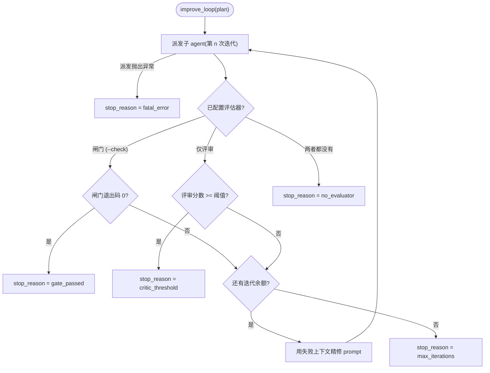

# 改进循环

`yanshi improve` 把一次性派发变成一个**有界的 `派发 → 评估 → 精修` 循环**。它派发一个子 agent,运行一个确定性闸门,如果闸门失败——就把失败反馈进 prompt 后重新派发,直到闸门通过或迭代预算耗尽。它沿用与监控内核相同的"确定性优先、低上下文"哲学:闸门是权威,任何 LLM 评审都只是建议性的。

## 循环流程



## 闸门是权威

闸门就是你传入的 `--check "<command>"`。它会用 `shlex` 解析为 argv,并**仅以 argv 方式**(绝不经过 shell)spawn。**退出码 `0` 表示通过**;其它任何值都是失败。

当闸门失败时,只有其合并后的 stdout/stderr 的截断尾部(由 `gate_output_limit` 限制,默认 4000 个字符)会被追加到下一轮 prompt——原始子进程流绝不会重新进入上下文。一个根本*无法运行*的闸门(例如缺少二进制或超时)会被记录在 `GateOutcome.error` 中,这与一个真正运行了却失败的测试是有区别的。

```bash
yanshi improve --cli claude "fix the failing unit tests" \
  --check "uv run pytest -q" --max-iterations 3
```

## 评审仅为建议性

可选的 `--critic` 启用一个 LLM 评审,它与滚动摘要器一样:只是建议性的,绝非权威。**仅在未配置闸门时**才会就成功判定征询它的意见。当*配置了*闸门时,由闸门决定;评审反馈(若启用)只会作为下一轮精修 prompt 的额外上下文。

## 边界与选项

循环始终是有界的。关键选项(完整列表见 [CLI 参考](reference.md#improve)):

| 选项 | 默认值 | 作用 |
|---|---|---|
| `--check` | — | 确定性闸门命令;退出码 `0` = 通过。 |
| `--max-iterations` | `3` | 派发 → 闸门 → 精修循环的硬上限(必须 ≥ 1)。 |
| `--gate-timeout` | `300` | 每次闸门的超时秒数;超时会判定闸门失败并被记录。 |
| `--critic` / `--no-critic` | `--no-critic` | 启用建议性评审。 |

## 停止原因

`ImproveResult.stop_reason` 恰好是以下之一:

| `stop_reason` | 含义 | `succeeded` |
|---|---|---|
| `gate_passed` | 确定性闸门返回退出码 `0`。 | `true` |
| `critic_threshold` | 未配置闸门;评审的分数达到了 `critic_threshold`。 | `true` |
| `max_iterations` | 迭代预算耗尽但仍未通过。 | `false` |
| `fatal_error` | 某次派发抛出异常;以终态结果加警告的形式暴露。 | `false` |
| `no_evaluator` | 既未配置闸门也未配置评审;只运行了一次。 | `not is_error` |

闸门、评审与派发的问题绝不会被吞掉:它们会出现在 `GateOutcome.error`、`ImproveResult.warnings`,或一个终态的 `fatal_error` 中。

## 精修与会话恢复

在两次迭代之间,YanShi 用原始任务加上内嵌的失败上下文(闸门输出、闸门错误,以及任何评审反馈)来构建下一轮 prompt。当适配器支持会话恢复且上一轮返回了 `session_id` 时,下一次迭代会恢复该会话;否则会以携带相同失败上下文的全新派发重新开始。

## Python 入口

该循环也可以直接从 Python 调用:

```python
import asyncio

from yanshi.contracts import ImproveSpec, RunSpec
from yanshi.improve import improve_loop


async def main() -> None:
    plan = ImproveSpec(
        spec=RunSpec(cli="claude", prompt="fix the failing unit tests"),
        check_command=["uv", "run", "pytest", "-q"],
        max_iterations=3,
    )
    result = await improve_loop(plan)
    print(result.succeeded, result.stop_reason)
    for iteration in result.iterations:
        gate = iteration.gate
        print(iteration.index, iteration.state, None if gate is None else gate.passed)


asyncio.run(main())
```

`improve_loop` 还接受可注入的 `gate_runner` 与 `critic_client`,这正是在不 spawn 真实进程或模型的情况下对闸门与评审进行单元测试的方式。

## 延伸阅读

- [CLI 参考 → improve](reference.md#improve) —— 所有选项。
- [Python API](../library/python-api.md) —— 契约与后台派发。
- [安全与策略](../concepts/safety.md) —— 仅 argv 的闸门执行与无静默失败。
