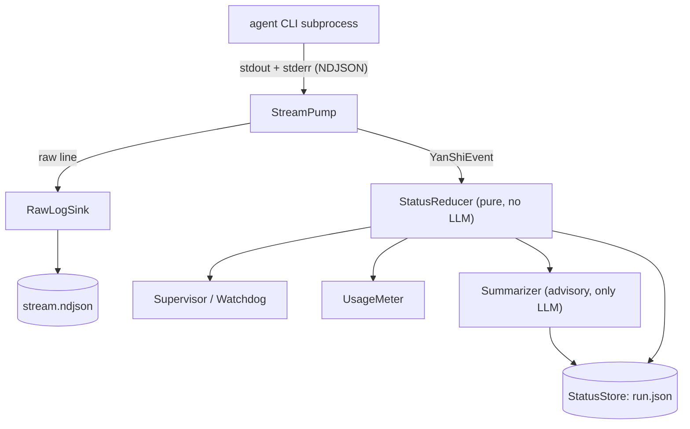

# Architecture

YanShi is built around a single insight: **separate the visibility plane from the context plane.**
Raw output is persisted to disk (visibility); the parent agent only ever pulls a small, deterministic
status object (context). Everything else follows from keeping that boundary clean.

## Visibility plane vs. context plane

- **Visibility plane** — the full, lossless record. Every raw line the child CLI emits is written to
  `stream.ndjson` for audit and debugging. It can be large; it never enters the parent's context
  window by default.
- **Context plane** — what the parent consumes. A compact `AgentStatus` plus a short advisory
  summary, pulled on demand for a few tens of tokens.

This split is what makes watching a fleet of heterogeneous CLIs affordable, and it is validated by
prior art in headless-agent control planes: persist raw streams, expose a tiny status object.

## The monitor kernel

A single **monitor kernel** drives one run from spawn to terminal state. The kernel spawns the CLI
with an argv list (never a shell), reads both stdout and stderr concurrently, normalizes each line
into a `YanShiEvent`, and folds those events into a deterministic status that is mirrored to disk.

| Stage | Responsibility | Uses an LLM? |
|---|---|---|
| **StreamPump** | Read stdout and stderr concurrently (so neither pipe deadlocks on a full buffer), split on newlines, tolerate non-JSON and unknown event types without crashing. | No |
| **StatusReducer** | Pure function `(status, event) -> status`: drive the FSM, increment counters, track the last tool, classify errors, and accumulate tokens/cost. | No |
| **Supervisor / Watchdog** | Wall-clock and stall timeouts, distinguishing rate-limit waits from long tools from a true hang; exit classification; graceful → `SIGKILL` escalation; bounded retry; the cost ceiling. | No |
| **RawLogSink** | Append raw NDJSON to disk with a bounded byte window (ring buffer), redacting secrets first. Never enters the parent context. | No |
| **UsageMeter** | Normalize tokens and cost; prefer native cost, otherwise a cached pricing table, otherwise mark pricing `missing`. | No |
| **Summarizer** | Produce a throttled, advisory 1–3 sentence rolling summary from a *compact* event digest; degrade to concatenating significant events when no model is available. | **Yes (the only one)** |
| **StatusStore** | Atomically mirror the status snapshot to `run.json` (temp file + rename + file lock, mode `0600`). | No |

Roughly 90% of monitoring — the FSM, counters, error class, tokens, and cost — is computed
deterministically. The advisory summary is the *only* field produced by a model, and it never feeds
back into any decision.

## One kernel, two entrypoints, pure-disk reads

The kernel exists once. What differs is **who runs it**; readers are always pure disk reads.

- **Entrypoint A — library / MCP / long-lived orchestrator (preferred).** The host owns an event
  loop. `dispatch_background(spec)` spawns the child inside a background `asyncio.Task` running the
  kernel, and `status()` / `summary()` read the mirrored snapshot. This is the natural mode for a
  resident MCP server or skill host.
- **Entrypoint B — blocking CLI `yanshi dispatch`.** A single process runs the kernel inline until
  the terminal `RunResult`. The status is mirrored to disk in real time, so a *separate* process can
  observe the run with pure disk reads while it runs.

!!! note "No fire-and-forget detached monitor"
    YanShi deliberately does **not** leave an independent monitor process running after `dispatch`
    returns. That single niche use case would drag in heartbeat liveness, cross-host orphan
    reclamation, and other complexity. Callers who want "dispatch and walk away" should host
    Entrypoint A in a long-lived process.

Because the monitor mirrors state to disk continuously, every reader is a **pure disk read** with
zero subprocess interaction and zero LLM calls:

- `status` / `summary` / `wait` / `list` / `fleet_status` only read `$YANSHI_HOME/agents/<id>/`.
- `wait` polls the on-disk `AgentStatus.state` until a terminal state or timeout.
- `cancel` interrupts the recorded child pid (or the in-process task) and finalizes `cancelled`.

## Owner-pid liveness

Each run record stores an `owner_pid` (the monitoring host) and a `child_pid`. If a reader sees a
non-terminal `running` state but the `owner_pid` is no longer alive, it deterministically corrects
the state to `stalled` and records a fatal error — there is no separate heartbeat thread to trust.
See [Troubleshooting](../troubleshooting.md#stale-running-corrected-to-stalled).

## Related reading

- [Monitoring](monitoring.md) — the FSM and the deterministic-vs-advisory split in depth.
- [Safety & Policy](safety.md) — permission modes, cost ceilings, and redaction.
- [Configuration](../reference/configuration.md) — the on-disk layout the kernel writes.
- [Python API](../library/python-api.md) — the two entrypoints in code.
