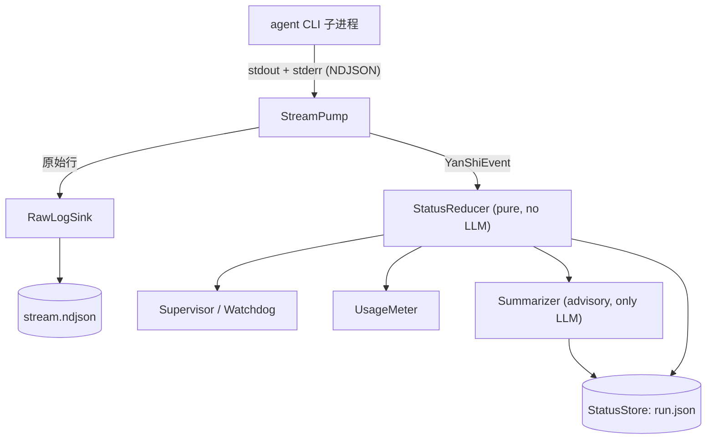

# 架构

YanShi 围绕一个核心洞见构建:**把可见性平面与上下文平面分离开。** 原始输出被持久化到磁盘
(可见性);上层 agent 永远只拉取一个小而确定性的状态对象(上下文)。其余的一切都源自于
保持这个边界的清晰。

## 可见性平面 vs. 上下文平面

- **可见性平面**——完整、无损的记录。子 CLI 发出的每一条原始行都会被写入 `stream.ndjson`
  以供审计和调试。它可能很大;默认情况下它绝不会进入上层的上下文窗口。
- **上下文平面**——上层所消费的内容。一个紧凑的 `AgentStatus` 加上一段简短的建议性摘要,
  按需拉取,只需几十个 token。

正是这种划分让观察一支异构 CLI 舰队负担得起,并且它也被 headless agent 控制平面的既有实践
所验证:持久化原始流,暴露一个极小的状态对象。

## 监控内核

单个**监控内核**驱动一次运行从 spawn 到终态。内核用 argv 列表(绝不用 shell)spawn 出
CLI,并发读取 stdout 和 stderr,把每一行归一化成一个 `YanShiEvent`,并把这些事件折叠进一个
确定性状态,再镜像到磁盘。

| 阶段 | 职责 | 是否用 LLM? |
|---|---|---|
| **StreamPump** | 并发读取 stdout 和 stderr(这样任一管道都不会因缓冲区写满而死锁),按换行切分,容忍非 JSON 与未知事件类型而不崩溃。 | 否 |
| **StatusReducer** | 纯函数 `(status, event) -> status`:驱动有限状态机、递增计数器、跟踪最后一个工具、分类错误,并累计 token/花费。 | 否 |
| **Supervisor / Watchdog** | 墙钟与停滞超时,区分限流等待、长时间运行的工具与真正的挂起;退出分类;优雅 → `SIGKILL` 的升级;有界重试;花费上限。 | 否 |
| **RawLogSink** | 以有界字节窗口(环形缓冲)把原始 NDJSON 追加到磁盘,并先对密钥脱敏。绝不进入上层上下文。 | 否 |
| **UsageMeter** | 归一化 token 与花费;优先使用原生花费,否则使用缓存的定价表,再否则把定价标记为 `missing`。 | 否 |
| **Summarizer** | 从*紧凑的*事件摘要中产出经过节流的、建议性的 1~3 句滚动摘要;当没有可用模型时,降级为拼接重要事件。 | **是(唯一的一个)** |
| **StatusStore** | 原子地把状态快照镜像到 `run.json`(临时文件 + 重命名 + 文件锁,模式 `0600`)。 | 否 |

大约 90% 的监控——有限状态机、计数器、错误分类、token 与花费——都是确定性计算的。建议性
摘要是*唯一*由模型产出的字段,而且它绝不会反馈进任何决策。

## 单内核、双入口、纯磁盘读取

内核只存在一份。不同的是**由谁来运行它**;读取方始终是纯磁盘读取。

- **入口 A——库 / MCP / 长驻编排器(首选)。** 宿主拥有一个事件循环。`dispatch_background(spec)`
  会在一个运行内核的后台 `asyncio.Task` 中 spawn 出子进程,而 `status()` / `summary()` 读取
  镜像出的快照。这是常驻 MCP 服务器或 skill 宿主的自然模式。
- **入口 B——阻塞式 CLI `yanshi dispatch`。** 单个进程内联运行内核,直到得到终态的
  `RunResult`。状态会实时镜像到磁盘,因此一个*独立*的进程可以在运行期间用纯磁盘读取来观察
  这次运行。

!!! note "没有发后即忘的脱离式监控进程"
    YanShi 刻意**不**在 `dispatch` 返回后留下一个独立的监控进程在运行。那个小众用例会牵扯进
    心跳存活检测、跨主机孤儿回收以及其他复杂性。想要「派发后就走开」的调用方应当在一个长驻
    进程中托管入口 A。

因为监控器会持续把状态镜像到磁盘,所以每个读取方都是**纯磁盘读取**,没有任何子进程交互,
也没有任何 LLM 调用:

- `status` / `summary` / `wait` / `list` / `fleet_status` 只读取 `$YANSHI_HOME/agents/<id>/`。
- `wait` 轮询磁盘上的 `AgentStatus.state`,直到终态或超时。
- `cancel` 中断记录在案的子 pid(或进程内任务),并把状态最终确定为 `cancelled`。

## owner-pid 存活检测

每条运行记录都保存一个 `owner_pid`(监控宿主)和一个 `child_pid`。如果某个读取方看到非终态的
`running` 状态,但 `owner_pid` 已不再存活,它会确定性地把状态修正为 `stalled` 并记录一个
致命错误——这里没有可信赖的独立心跳线程。见
[故障排查](../troubleshooting.md#stale-running-corrected-to-stalled)。

## 相关阅读

- [监控](monitoring.md)——深入讲解有限状态机以及确定性与建议性的划分。
- [安全与策略](safety.md)——权限模式、花费上限与脱敏。
- [配置](../reference/configuration.md)——内核写入的磁盘布局。
- [Python API](../library/python-api.md)——两个入口在代码中的样子。
