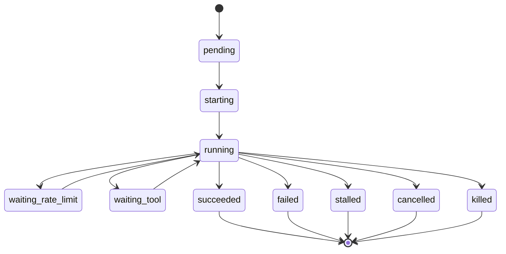

# Monitoring

YanShi's monitoring is **deterministic first**. The state machine, counters, error classification,
token totals, and cost are all computed by a pure reducer — no model involved. A single advisory
summarizer produces one free-text field. This page explains that split and the guarantees it gives
a parent agent.

## Deterministic reducer vs. advisory summarizer

| | `StatusReducer` | `RollingSummarizer` |
|---|---|---|
| Output | The whole `AgentStatus` except `rolling_summary` | Only `rolling_summary` |
| Determinism | Pure function `(status, event) -> status` | Advisory; may vary or be unavailable |
| Uses an LLM | No | Yes (the only component that does) |
| Trusted for decisions | Yes | No |

The reducer never mutates its input; it returns a new status for each event. The summarizer reads a
*compact digest* of significant events and writes a short narrative — it is explicitly forbidden from
influencing any deterministic field.

## The finite-state machine

Every run advances through a normalized FSM. The canonical happy path is:

`pending → starting → running → {waiting_rate_limit | waiting_tool} → running → terminal`

The five terminal states are `succeeded`, `failed`, `stalled`, `cancelled`, and `killed`. Transitions
are validated: an attempt to move out of a terminal state, or along an illegal edge, is recorded as a
non-fatal error rather than silently applied.

How events map to states:

- A `started` event moves `pending → starting`, otherwise to `running`.
- `assistant_text`, `reasoning`, and `usage` keep the run `running`.
- `tool_use` moves to `waiting_tool` (and increments the `tool_calls` counter); `tool_result`
  returns to `running`.
- `error` moves to `failed` and appends a classified, fatal `ErrorRecord`.
- `completed` moves to `succeeded`, or to `failed` when the terminal event is flagged as an error.

## What the parent consumes

A parent agent reads exactly two things, both pure disk reads:

- **`status`** → an `AgentStatus` with the deterministic fields below.
- **`summary`** → the advisory `rolling_summary` string (falling back to the last event's summary).

Key `AgentStatus` fields:

| Field | Meaning |
|---|---|
| `state` | Current FSM state. |
| `progress_pct` | Integer percent, or `null` when it cannot be known deterministically. |
| `last_event` | Compact `{kind, summary, ts}` of the most recent event (summary truncated). |
| `liveness` | `{idle_seconds, stalled, waiting_reason}`. |
| `counters` | Event tallies: `events`, `tool_calls`, `files_changed`, `unknown_events`, per-kind counts. |
| `usage` | Normalized `Usage` (input / cached / output / reasoning tokens; `total` is derived). |
| `cost_usd` / `pricing_status` | Cost and its provenance: `native`, `priced`, or `missing`. |
| `errors` / `warnings` | Structured records (category, message, fatal flag). |
| `rolling_summary` | The **only** advisory field. |
| `owner_pid` / `child_pid` | Monitoring host and child process ids, for liveness checks. |

!!! warning "Pull status and summary — never the raw stream"
    The raw NDJSON lives in the visibility plane at `stream.ndjson`. Parent agents must not read it
    into context unless a human explicitly asks for raw logs.

## The advisory summarizer

The summarizer is throttled and degrades gracefully:

- **Trigger** — only on semantically significant events (`tool_use`, `tool_result`, `error`,
  `completed`, `file_change`) once a debounce window (≥5s) and a minimum number of new significant
  events have passed. Token deltas alone are treated as liveness evidence, not summarization
  triggers.
- **Input** — a compact, structured digest of recent significant events, **not** the raw log.
- **Output** — a bounded 1–3 sentence string.
- **Fallback** — when no model client is available, the model errors, or a watcher token budget is
  exceeded, it concatenates the last few significant events instead. The result carries a
  `used_llm` provenance flag and a warning, so a degraded summary is never mistaken for a model one.

## Anti-hallucination guarantees

- Every field a caller might act on comes from the deterministic reducer.
- `progress_pct` is `null` whenever it cannot be derived — the model is **never** asked to invent it.
- Errors are classified into governance categories (`rate_limit`, `auth`, `billing`,
  `server_error`, …) by deterministic text matching, with the raw message preserved alongside.
- The summarizer's text is advisory and clearly marked; it does not change `state`, `usage`, or
  `cost`.

## Related reading

- [Architecture](architecture.md) — where the reducer and summarizer sit in the kernel.
- [Safety & Policy](safety.md) — cost ceilings and the supervisor.
- [Troubleshooting](../troubleshooting.md) — interpreting `stalled` vs. `waiting_*`.
