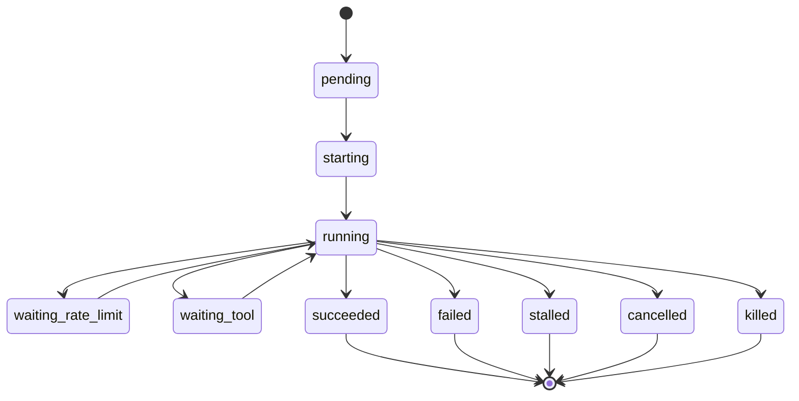

# 监控

YanShi 的监控是**确定性优先**的。状态机、计数器、错误分类、token 总量与花费,全部由一个纯
reducer 计算——不涉及任何模型。单个建议性的 summarizer 产出一个自由文本字段。本页解释这种
划分,以及它给上层 agent 带来的保证。

## 确定性 reducer vs. 建议性 summarizer

| | `StatusReducer` | `RollingSummarizer` |
|---|---|---|
| 输出 | 除 `rolling_summary` 外的整个 `AgentStatus` | 仅 `rolling_summary` |
| 确定性 | 纯函数 `(status, event) -> status` | 建议性;可能变化或不可用 |
| 是否用 LLM | 否 | 是(唯一这样做的组件) |
| 可信赖用于决策 | 是 | 否 |

reducer 绝不修改它的输入;它为每个事件返回一个新状态。summarizer 读取重要事件的*紧凑摘要*
并写出一段简短叙述——它被明确禁止影响任何确定性字段。

## 有限状态机

每次运行都会沿着一个归一化的有限状态机推进。标准的顺利路径是:

`pending → starting → running → {waiting_rate_limit | waiting_tool} → running → terminal`

五个终态是 `succeeded`、`failed`、`stalled`、`cancelled` 和 `killed`。转移会被校验:试图离开
某个终态,或沿着一条非法边移动,都会被记录为非致命错误,而不是被悄悄执行。

事件如何映射到状态:

- `started` 事件把状态从 `pending → starting` 移动,否则移动到 `running`。
- `assistant_text`、`reasoning` 和 `usage` 让运行保持 `running`。
- `tool_use` 移动到 `waiting_tool`(并递增 `tool_calls` 计数器);`tool_result` 返回到 `running`。
- `error` 移动到 `failed`,并追加一个已分类的、致命的 `ErrorRecord`。
- `completed` 移动到 `succeeded`,或者当终态事件被标记为错误时移动到 `failed`。

## 上层消费什么

上层 agent 恰好读取两样东西,两者都是纯磁盘读取:

- **`status`** → 一个带有下列确定性字段的 `AgentStatus`。
- **`summary`** → 建议性的 `rolling_summary` 字符串(回退到最后一个事件的摘要)。

关键的 `AgentStatus` 字段:

| 字段 | 含义 |
|---|---|
| `state` | 当前有限状态机状态。 |
| `progress_pct` | 整数百分比,或当无法确定性地得知时为 `null`。 |
| `last_event` | 最近一个事件的紧凑 `{kind, summary, ts}`(summary 被截断)。 |
| `liveness` | `{idle_seconds, stalled, waiting_reason}`。 |
| `counters` | 事件计数:`events`、`tool_calls`、`files_changed`、`unknown_events`,以及按种类的计数。 |
| `usage` | 归一化的 `Usage`(输入 / 缓存 / 输出 / 推理 token;`total` 为派生值)。 |
| `cost_usd` / `pricing_status` | 花费及其来源:`native`、`priced` 或 `missing`。 |
| `errors` / `warnings` | 结构化记录(类别、消息、致命标志)。 |
| `rolling_summary` | **唯一**的建议性字段。 |
| `owner_pid` / `child_pid` | 监控宿主与子进程的 id,用于存活检查。 |

!!! warning "拉取 status 和 summary——绝不拉取原始流"
    原始 NDJSON 位于可见性平面的 `stream.ndjson` 中。上层 agent 绝不能把它读进上下文,
    除非有人明确要求查看原始日志。

## 建议性 summarizer

summarizer 经过节流,并会优雅降级:

- **触发**——仅在语义上重要的事件(`tool_use`、`tool_result`、`error`、`completed`、
  `file_change`)上触发,且需经过一个去抖窗口(≥5s)以及达到最少数量的新增重要事件。单独的
  token 增量被视为存活证据,而非摘要触发条件。
- **输入**——近期重要事件的紧凑、结构化摘要,**而非**原始日志。
- **输出**——一段有界的 1~3 句字符串。
- **回退**——当没有可用的模型客户端、模型报错,或观察者的 token 预算被超出时,它转而拼接
  最近的几个重要事件。结果带有一个 `used_llm` 来源标志和一条警告,因此降级摘要绝不会被
  误认为是模型生成的摘要。

## 反幻觉保证

- 调用方可能据以行动的每一个字段,都来自确定性 reducer。
- 只要 `progress_pct` 无法被推导出来,它就是 `null`——**绝不**会让模型去臆造它。
- 错误通过确定性的文本匹配被分类到治理类别(`rate_limit`、`auth`、`billing`、
  `server_error`、……)中,同时保留原始消息。
- summarizer 的文本是建议性的且有明确标注;它不会改变 `state`、`usage` 或 `cost`。

## 相关阅读

- [架构](architecture.md)——reducer 与 summarizer 在内核中的位置。
- [安全与策略](safety.md)——花费上限与 supervisor。
- [故障排查](../troubleshooting.md)——解读 `stalled` 与 `waiting_*` 的区别。
