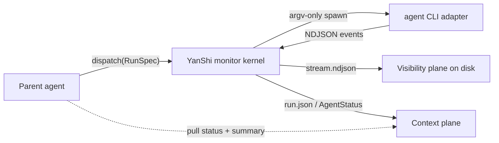

<section class="ys-hero" markdown="1">

<h1 class="ys-wordmark">YanShi 偃师</h1>

In the Liezi, the artificer Yan Shi presents a figure that walks and sings — yet keeps one hand on every thread.

Vendor-neutral sub-agent dispatch for parent agents that need control, not log noise.

YanShi gives a parent agent one precise contract for spawning headless agent CLIs, then returns a
deterministic, low-context view of each run. The raw stream remains on disk for audit; the parent
pulls only the control threads it needs: `AgentStatus`, an advisory summary, and explicit errors.

[Start with the quickstart](getting-started/quickstart.md){ .md-button .md-button--primary }
[Read the architecture](concepts/architecture.md){ .md-button }

</section>

<section class="ys-section ys-section--thread" markdown="1">

## The control frame

YanShi is for orchestrators that already know how expensive context is. A parent agent can dispatch
`claude`, `codex`, `cursor-agent`, or `gemini` through one [`RunSpec`](library/python-api.md), while
each adapter translates the same intent into vendor-specific flags and normalizes events back into
one shape.

The result is sovereign without being vendor-bound: add a CLI by writing an adapter, not by rewriting
the host process that observes it.

</section>

<section class="ys-section" markdown="1">

## First run, low context

1. **Install and inspect.** Use the bundled installer or `uv`, then run `yanshi doctor` to see which
   adapters are present and authenticated.
2. **Dispatch through one contract.** `yanshi dispatch --cli claude --effort high "Summarize this repo"`
   runs the shared monitor kernel and records the run under `$YANSHI_HOME`.
3. **Pull only what matters.** `yanshi status <agent_id>` returns deterministic state, counters,
   usage, cost, warnings, and errors. `yanshi summary <agent_id>` returns a short advisory summary.
4. **Iterate with a gate.** `yanshi improve --check "uv run pytest -q"` runs a bounded
   **dispatch -> gate -> refine** loop where the check command is authoritative.

</section>

<section class="ys-section" markdown="1">

## Two planes, one boundary

| Plane | What it keeps | Who should read it |
|---|---|---|
| **Visibility plane** | Every raw event, secret-redacted and persisted to `stream.ndjson` | Humans auditing or debugging a run |
| **Context plane** | A compact `AgentStatus` plus a 1-3 sentence advisory summary | The parent agent, on demand |

The monitor kernel reads stdout and stderr concurrently, folds normalized events through a pure
status reducer, and mirrors the snapshot to disk with atomic writes. The parent never tails the child
stream by default; it reads the stable context plane through `status`, `summary`, `wait`, `list`, and
fleet helpers.

</section>

<section class="ys-section" markdown="1">

## Safety and adapters

Five invariants hold before any child process starts. They are the contract, not the marketing.

Safe defaults
:   `read-only` is the default permission mode. `yolo` is never implied, and policy validation rejects unsafe combinations before a child process starts.

Faithful execution
:   YanShi spawns every CLI from an argv list with `shell=False`. Prompts and improve-loop gates are never interpolated into a shell command line.

Explicit degradation
:   Adapter capability gaps, missing pricing, gate failures, and runtime errors are surfaced as warnings or errors. Unsupported controls are never silently faked.

Portable mechanisms
:   Adapters cover `claude`, `codex`, `cursor`, and `gemini` while preserving the same `RunSpec`, `RunResult`, and `AgentStatus` contracts for the host.

</section>

<section class="ys-section" markdown="1">

## Configure, then scale

YanShi works with built-in defaults, but a repo can add `.yanshi.toml` through `yanshi init` to define
enabled adapters, summarizer settings, dispatch defaults, profiles, and hard limits. Larger hosts can
fan out with `dispatch_many`, aggregate with `fleet_status`, and consolidate results while raw
NDJSON stays outside the parent's context window.

</section>

<section class="ys-section ys-next" markdown="1">

## Where to next

- [Installation](getting-started/installation.md) — install the `yanshi` CLI with `install.sh`, `uv`,
  or `pip`.
- [Quickstart](getting-started/quickstart.md) — dispatch the first sub-agent and monitor it without
  reading raw streams.
- [Architecture](concepts/architecture.md) — the monitor kernel, two planes, and pure-disk readers.
- [Safety & Policy](concepts/safety.md) — permission modes, argv-only spawning, redaction, and cost
  ceilings.
- [Configuration](reference/configuration.md) — `.yanshi.toml`, profiles, limits, and `$YANSHI_HOME`.
- [Improve Loop](cli/improve-loop.md) — the bounded dispatch, gate, and refine cycle.

</section>

!!! note "Design source of truth"
    YanShi implements the normative design in `.local/memory/specs/yanshi/spec.md` without changing
    its decisions. This documentation describes the implementation as it ships.
