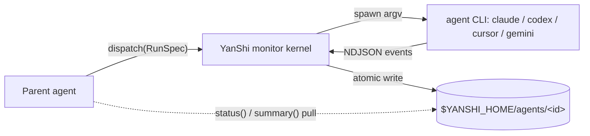

# YanShi

**A vendor-neutral sub-agent dispatch layer with deterministic, low-context monitoring.**

YanShi (燕十三) lets a parent agent dispatch work to any headless agent CLI —
`claude`, `codex`, `cursor-agent`, or `gemini` — through **one contract**, then watch it with
**deterministic, compact status objects** instead of raw log streams. Spawning a sub-agent should
not lock you into a single vendor, and monitoring it should not flood your context window.

## What & why

Orchestrating sub-agents today forces two unhappy choices: bind to one vendor's SDK, or tail a
firehose of raw output into your own context. YanShi removes both:

- **One contract, many CLIs.** Describe a task once with a [`RunSpec`](library/python-api.md);
  a per-CLI adapter translates it into vendor flags and normalizes the vendor's event stream back
  into a single shape. Adding a CLI means writing one adapter, not rewriting your orchestrator.
- **Tens of tokens per poll.** The parent pulls a small `AgentStatus` plus a 1–3 sentence rolling
  summary. The raw NDJSON stays on disk for audit; it never enters the parent's context unless a
  human explicitly asks for it.

## Visibility plane vs. context plane

The central idea is a strict separation of two planes:

| Plane | Holds | Who reads it |
|---|---|---|
| **Visibility plane** | Every raw event, persisted to `stream.ndjson` on disk | Audit / debugging only |
| **Context plane** | A compact `AgentStatus` + advisory summary | The parent agent, on demand |

Raw streams land in the visibility plane; the parent agent lives entirely in the context plane.
This is what keeps fleet orchestration affordable: you can watch many heterogeneous CLIs while
spending only a few tokens per status poll.

## Key features

- **One contract, many CLIs** — dispatch with a single `RunSpec`; add a CLI by writing one adapter.
- **Low-context monitoring** — pull a compact `AgentStatus` and a short rolling summary; raw streams
  stay on disk.
- **Deterministic by design** — the finite-state machine, counters, error class, tokens, and cost
  are all computed without an LLM. Only the rolling summary is advisory.
- **Safe by default** — `read-only` permission mode by default, `yolo` only when explicit;
  argv-only spawning (never `shell=True`); secret redaction; per-run and global cost ceilings.
- **Fleets** — fan out with `dispatch_many`, aggregate with `fleet_status`, and merge with
  `consolidate`, all with failure isolation.
- **Improve loop** — a bounded *dispatch → gate → refine* cycle driven by a deterministic check
  command.
- **Skill + MCP** — a `SKILL.md` contract and an optional MCP server shim for agent hosts.

## Architecture at a glance

The parent dispatches a `RunSpec`; the kernel spawns the CLI with an argv list, parses its event
stream, and mirrors a deterministic status to disk. The parent then *pulls* status and summary —
it never reads the child's raw stream.

## Where to next

- [Installation](getting-started/installation.md) — install the `yanshi` CLI with `install.sh`,
  `uv`, or `pip`.
- [Quickstart](getting-started/quickstart.md) — dispatch your first sub-agent and monitor it.
- [Architecture](concepts/architecture.md) — the one-kernel / two-entrypoints / pure-disk-read
  model.
- [CLI Reference](cli/reference.md) — every `yanshi` verb and its options.

!!! note "Design source of truth"
    YanShi implements the normative design in `.local/memory/specs/yanshi/spec.md` without
    changing its decisions. This documentation describes the implementation as it ships.
