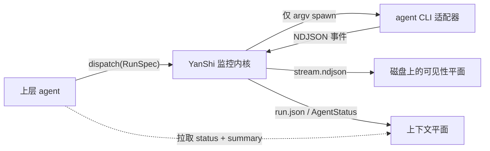

<section class="ys-hero" markdown="1">

<h1 class="ys-wordmark">YanShi 偃师</h1>

《列子》记载，匠人偃师献上能行能歌的伶人——而每一根丝线，始终系于他手。

面向上层 agent 的厂商中立子智能体派发层：要控制线索，不要日志噪声。

YanShi 让上层 agent 用一套精确契约派生 headless agent CLI，并为每次运行返回确定性、
低上下文的观察结果。原始流留在磁盘上供审计；上层只拉取真正需要的控制线索：
`AgentStatus`、建议性摘要，以及显式错误。

[从快速开始进入](getting-started/quickstart.md){ .md-button .md-button--primary }
[阅读架构](concepts/architecture.md){ .md-button }

</section>

<section class="ys-section ys-section--thread" markdown="1">

## 控制框架

YanShi 面向已经知道上下文成本有多高的编排器。上层 agent 可以通过一个
[`RunSpec`](library/python-api.md) 派发 `claude`、`codex`、`cursor-agent` 或 `gemini`；
每个适配器把同一份意图翻译成厂商参数，再把事件归一化回同一种形态。

它保持主权感，但不绑定任何厂商：新增 CLI 意味着编写一个适配器，而不是重写负责观察它的宿主进程。

</section>

<section class="ys-section" markdown="1">

## 第一轮运行，低上下文观察

1. **安装并检查。** 使用内置安装脚本或 `uv`，再运行 `yanshi doctor` 查看哪些适配器已经存在并完成认证。
2. **通过一套契约派发。** `yanshi dispatch --cli claude --effort high "Summarize this repo"`
   运行共享监控内核，并把运行记录写入 `$YANSHI_HOME`。
3. **只拉取必要信息。** `yanshi status <agent_id>` 返回确定性的状态、计数器、用量、花费、
   警告和错误；`yanshi summary <agent_id>` 返回简短的建议性摘要。
4. **用闸门迭代。** `yanshi improve --check "uv run pytest -q"` 运行有界的
   **派发 -> 闸门 -> 精修** 循环，其中检查命令拥有最终裁决权。

</section>

<section class="ys-section" markdown="1">

## 两个平面，一条边界

| 平面 | 保存什么 | 谁应该读取 |
|---|---|---|
| **可见性平面** | 每一条原始事件，先脱敏再持久化到 `stream.ndjson` | 审计或调试运行的人 |
| **上下文平面** | 紧凑的 `AgentStatus` 加 1-3 句建议性摘要 | 上层 agent 按需读取 |

监控内核并发读取 stdout 与 stderr，把归一化事件折叠进纯函数状态规约器，并用原子写把快照镜像到磁盘。
上层默认不 tail 子进程流；它通过 `status`、`summary`、`wait`、`list` 和舰队辅助函数读取稳定的上下文平面。

</section>

<section class="ys-section" markdown="1">

## 安全与适配器

子进程启动之前，有几条不变量始终成立。它们是契约，而非营销话术。

默认安全
:   `read-only` 是默认权限模式。`yolo` 绝不会被隐式启用；策略校验会在子进程启动前拒绝不安全组合。

忠实执行
:   YanShi 始终用 argv 列表和 `shell=False` spawn CLI。prompt 与改进循环的闸门命令都不会被插入 shell 命令行。

显式降级
:   适配器能力缺口、缺失价格、闸门失败和运行时错误都会进入警告或错误。YanShi 不会假装不支持的控制已经生效。

可移植机制
:   适配器覆盖 `claude`、`codex`、`cursor` 与 `gemini`，同时为宿主保留同一套 `RunSpec`、`RunResult` 和 `AgentStatus` 契约。

</section>

<section class="ys-section" markdown="1">

## 先配置，再扩展

YanShi 可以直接使用内置默认值；仓库也可以通过 `yanshi init` 添加 `.yanshi.toml`，声明启用的适配器、
摘要器设置、派发默认值、profiles 与硬限制。更大的宿主可以用 `dispatch_many` 扇出，用
`fleet_status` 聚合，并用 `consolidate` 合并结果，同时让原始 NDJSON 始终留在上层上下文之外。

</section>

<section class="ys-section ys-next" markdown="1">

## 接下来去哪

- [安装](getting-started/installation.md)——用 `install.sh`、`uv` 或 `pip` 安装 `yanshi` CLI。
- [快速开始](getting-started/quickstart.md)——派发第一个子智能体，并在不读取原始流的情况下观察它。
- [架构](concepts/architecture.md)——监控内核、两个平面与纯磁盘读取器。
- [安全与策略](concepts/safety.md)——权限模式、仅 argv spawn、脱敏与花费上限。
- [配置](reference/configuration.md)——`.yanshi.toml`、profiles、limits 与 `$YANSHI_HOME`。
- [改进循环](cli/improve-loop.md)——有界的派发、闸门与精修循环。

</section>

!!! note "设计的源头真相"
    YanShi 实现了 `.local/memory/specs/yanshi/spec.md` 中的规范性设计，且不改变其中的决策。
    本文档描述的是随版本交付的实现。
