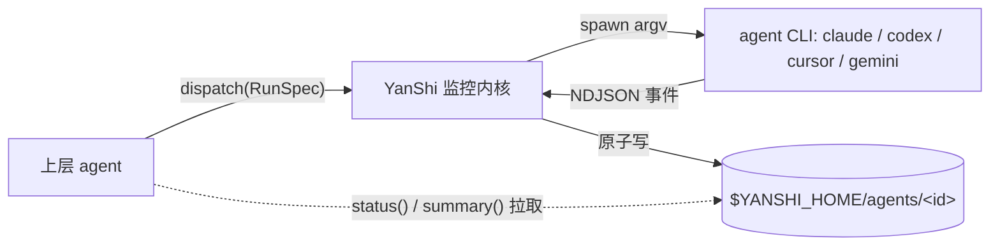

# YanShi

**一个厂商中立的子智能体派发层,具备确定性、低上下文的监控能力。**

YanShi(燕十三)让上层 agent 通过**一套契约**,把工作派发给任意 headless agent CLI——
`claude`、`codex`、`cursor-agent` 或 `gemini`——然后用**确定性、紧凑的状态对象**进行观察,
而不是读取原始日志流。派生一个子智能体不应让你被锁死在单一厂商上,监控它也不应淹没你的上下文窗口。

## 是什么,以及为什么

如今编排子智能体迫使你做出两个糟糕的选择:绑定到某一厂商的 SDK,或把原始输出的洪流灌进
自己的上下文。YanShi 把两者都去掉了:

- **一套契约,多种 CLI。** 用一个 [`RunSpec`](library/python-api.md) 描述一次任务;
  每个 CLI 的适配器会把它翻译成厂商参数,并把厂商的事件流归一化回单一形态。新增一个 CLI
  只意味着编写一个适配器,而不必重写你的编排器。
- **每次轮询只花几十个 token。** 上层拉取一个小的 `AgentStatus` 加上 1~3 句的滚动摘要。
  原始 NDJSON 留在磁盘上以供审计;除非有人明确要求,它绝不会进入上层的上下文。

## 可见性平面 vs. 上下文平面

核心思想是严格区分两个平面:

| 平面 | 承载内容 | 谁来读取 |
|---|---|---|
| **可见性平面** | 每一条原始事件,持久化到磁盘上的 `stream.ndjson` | 仅用于审计 / 调试 |
| **上下文平面** | 紧凑的 `AgentStatus` + 建议性摘要 | 上层 agent,按需读取 |

原始流落在可见性平面;上层 agent 完全生活在上下文平面里。这正是让舰队编排负担得起的原因:
你可以观察许多异构的 CLI,而每次状态轮询只花费几十个 token。

## 核心特性

- **一套契约,多种 CLI**——用单个 `RunSpec` 派发;新增一个 CLI 只需编写一个适配器。
- **低上下文监控**——拉取紧凑的 `AgentStatus` 和一段简短的滚动摘要;原始流留在磁盘上。
- **生而确定**——有限状态机、计数器、错误分类、token 与花费全部不借助 LLM 计算。
  只有滚动摘要是建议性的。
- **默认安全**——默认 `read-only` 权限模式,`yolo` 仅在显式指定时启用;仅以 argv 方式
  spawn(绝不 `shell=True`);密钥脱敏;每次运行与全局的花费上限。
- **舰队**——用 `dispatch_many` 扇出,用 `fleet_status` 聚合,用 `consolidate` 合并,
  全程具备失败隔离。
- **改进循环**——一个由确定性检查命令驱动的、有界的 *派发 → 闸门 → 精修* 循环。
- **Skill + MCP**——一份 `SKILL.md` 契约,以及面向 agent 宿主的可选 MCP 服务器垫片。

## 架构速览

上层派发一个 `RunSpec`;内核用 argv 列表 spawn 出 CLI,解析它的事件流,并把确定性状态镜像到
磁盘。随后上层*拉取*状态与摘要——它绝不会读取子进程的原始流。

## 接下来去哪

- [安装](getting-started/installation.md)——用 `install.sh`、`uv` 或 `pip` 安装 `yanshi` CLI。
- [快速开始](getting-started/quickstart.md)——派发你的第一个子智能体并监控它。
- [架构](concepts/architecture.md)——单内核 / 双入口 / 纯磁盘读取模型。
- [命令参考](cli/reference.md)——每一个 `yanshi` 动词及其选项。

!!! note "设计的源头真相"
    YanShi 实现了 `.local/memory/specs/yanshi/spec.md` 中的规范性设计,且不改变其中的决策。
    本文档描述的是随版本交付的实现。
